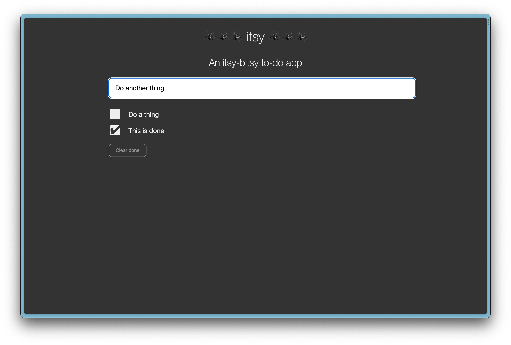

# itsy



**itsy** is an "itsy-bitsy to-do app" that is mostly an experiment in learning to live without
bundles and package managers and reaching for a library every time I needed something.
You'll notice that there's not even a `package.json` in the project.

## Running itsy

You can run **itsy** without installing any node modules. It uses `npx` to launch a [Web Dev
Server](https://modern-web.dev/guides/dev-server/getting-started/) locally, but then is
completely self-contained. It uses [ES6
modules](https://developer.mozilla.org/en-US/docs/Web/JavaScript/Guide/Modules) to import
code as needed. This approach is surprisngly well supported across all browsers.

```sh
 ./scripts/start.sh
```

The hand-built libraries include two kinds of [Web
Components](https://developer.mozilla.org/en-US/docs/Web/API/Web_Components) that can be
extended. One handles basic properties and rendering while the other connects to a
[Redux](https://redux.js.org/)-like state management store (also hand-built). It was
informative to dig into existing libraries like [Lit](https://lit.dev/) and
[Zustand](https://docs.pmnd.rs/zustand/getting-started/introduction) to grok the basic
concepts and then implement them as simply as possible.

## Running tests

Yeah, same thing for tests. Again, it uses `npx` to launch [Web Test
Runner](https://modern-web.dev/guides/test-runner/). The test runner dependencies (really
just the assertion library) are all local. It was equally surprising how simple an
assertion library really is when you don't need syntax like `expect(x).to.deep.equal(y)`.

```sh
 ./scripts/test.sh
```
